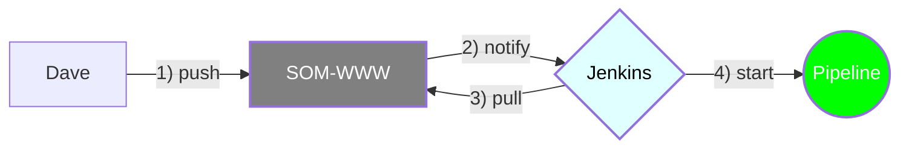
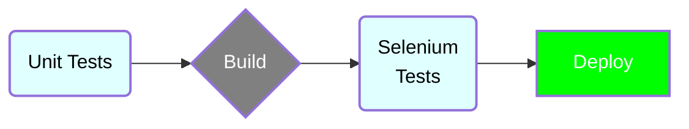

# Jenkins Worflow

test
test2
test3
test4
test5
test
test

my pull request stuff!!!!!

# Pipeline Workflow

## General Questions

### Will we be using docker to build the website? Or are we going to launch to AWS?  (I had trouble using the docker instructions)
 

### Is there a single development branch all the devs work on before merging to main? Or do they   each have their own branch?
 

### How do we make sure all the developers are in sync? E.g. "Hey I'm about to commit to main". For instance says   Dave is working on feature 1 then mike is working on feature 2. How do we make sure that if Dave commits   feature 1 to main that Mike first checks out Daves newest commit before merging to main?
 

### Where are the unit tests in the SOM-WWW repo? Also how are the selenium tests created?
 

### What kind of agents will we use in Jenkins? Docker containers? AWS?
 

### What visualization tools will we use? E.g. Blue Ocean?
   
   test
test
test
test
test
test
test
test
test
test
test
test
test
test
test
